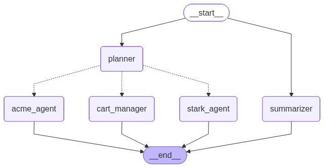

# Multi Agent Reference Architecture

Reference architecture for distributed multi-agent AI systems using LangGraph orchestration, remote agent-to-agent communication, Langfuse observability, OpenAI LLMs, and context summarization.

---

## Overview

This repository demonstrates a simple e-commerce multi-agent system built using LangGraph and OpenAI.

The application simulates an intelligent shopping assistant capable of:

- Product/item lookup
- Cart management
- Checkout orchestration
- Remote agent-to-agent (A2A) communication
- Context summarization for long-running workflows
- Request tracing and observability using Langfuse

The goal of this project is to showcase practical patterns for building production-oriented agentic AI systems.

---

## Features

- LangGraph planner-based orchestration
- Multiple specialized agent nodes
- Remote A2A agent invocation
- OpenAI-powered reasoning
- Langfuse tracing and monitoring
- Context summarization to reduce token usage
- Modular and extensible architecture

---

## LangGraph Workflow




---

## Agent Responsibilities

### Planner Agent
Routes requests between specialized agents and coordinates workflow execution.

### Acme agent
Agent that know about items catalog and order management for Acme corp.

### Stark agent
Agent that know about items catalog and order management for Stark corp.

### Cart Agent
Maintains shopping cart state and item aggregation for items from ALL agents.

### Summarization Agent
Compresses conversation and execution history to keep context window size under control for long-running sessions.

---

## Tech Stack

| Component | Technology |
|---|---|
| Orchestration | LangGraph |
| LLM | OpenAI |
| Observability | Langfuse |
| Backend | Python |
| Agent Communication | A2A |
| Context Management | Summarization Node |

---

## Repository Structure

```text
multi-agent-reference-arch/
│
├── agent/
│   │
│   ├── model/
│   │   └── # Pydantic request/response models
│   │
│   ├── nodes/
│   │   └── # LangGraph nodes
│   │
│   ├── main.py
│   │   └── # FastAPI application and LangGraph entrypoint
│   │
│   ├── pyproject.toml
│   ├── uv.lock
│   └── .venv/
│
├── remote_agent/
│   │
│   ├── main_agent.py
│   │   └── # Remote ADK agent and A2A endpoint
│   │
│   ├── pyproject.toml
│   ├── uv.lock
│   └── .venv/
│
├── README.md
│
└── .gitignore
```

---

## Observability

Langfuse is integrated for:

- Request tracing
- Execution monitoring
- Token usage tracking
- Latency analysis
- Debugging multi-agent workflows

---

## Context Management

Long-running agent workflows can rapidly increase token usage and context size.

This project includes a dedicated summarization node that periodically compresses execution history into concise summaries, helping:

- Reduce token consumption
- Improve latency
- Prevent context overflow
- Maintain conversation continuity

The summarization node runs in parallel to the other nodes to improve latency.

---

## Future Enhancements

- Memory persistence
- Human-in-the-loop approval
- Multi-model routing
- Retry and fallback strategies
- Streaming responses
- Evaluation pipelines
- AWS deployment patterns
- Redis checkpointing
- Event-driven execution

---

## Getting Started

### Clone Repository

```bash
git clone https://github.com/<your-username>/multi-agent-reference-arch.git

cd multi-agent-reference-arch
```

### Install Dependencies

```bash
uv sync
```

### Configure Environment Variables

```bash
OPENAI_API_KEY=

LANGFUSE_SECRET_KEY=
LANGFUSE_PUBLIC_KEY=
LANGFUSE_HOST=
```

### Run Application

```bash
start_remote_agent.sh - Start the remote agent
start_agent - Start the main agent
```

---

## Purpose

This repository is intended as a learning and reference architecture for engineers building production-grade agentic AI systems.

It focuses on practical orchestration patterns, observability, modular agent design, and scalable workflow management.

---

## License

MIT
